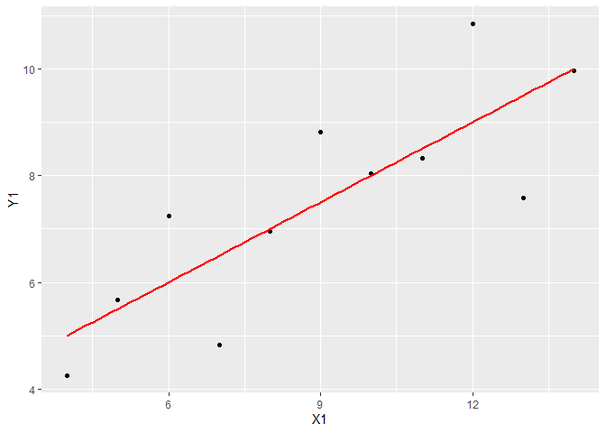
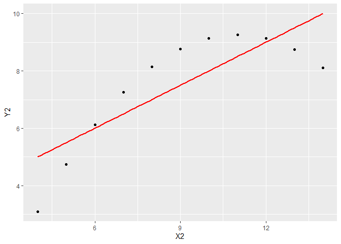
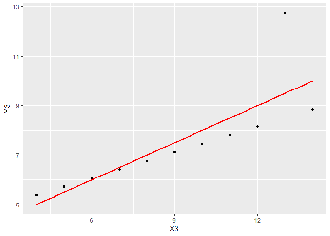
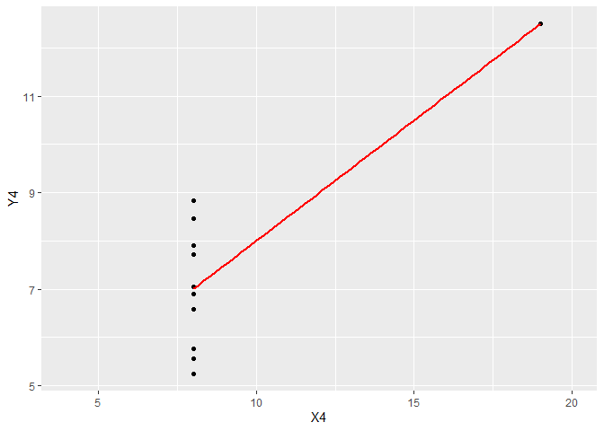

Chapter 02 단순선형회귀
================

## 2.0 library

``` r
library(ggplot2)
```

## 2.1 소개

반응변수
와
하나의 예측변수

사이의 관계를 연구하는 간단한 경우를 가지고 시작한다.

## 2.2 공분산과 상관계수

|                                                    번호                                                    |     반응변수       |     예측변수       |
|:----------------------------------------------------------------------------------------------------------:|:----------------------------------------------------------------------------------------------------------:|:----------------------------------------------------------------------------------------------------------:|
|                    |              |              |
|                    |              |              |
|  |  |  |
|                    |              |              |

-   표본평균

    

-   공분산

     = \frac{\sum_{i=1}^n (y_i - \bar{y})(x_i - \bar{x})}{n-1}
    ")

 > 0")이면
와

사이에 양의 관계가 있다.
 < 0")이면
와

사이에 음의 관계가 있다. 공분산은 측정단위의 변화에 영향을 받는다.
이러한 공분산의 단점을 피하기 위해, 계산하기 전에 표준화를 할 수 있다.

-   표준화


데이터를 표준화하면

^2}{n-1}}
")

-   상관계수

     &= \frac{1}{n-1} \sum_{i=1}^n \left(\frac{y_i - \bar y}{s_y} \right) \left(\frac{x_i - \bar x}{s_x} \right)
    \\
    &= \frac{\text{Cov}(Y, X)}{s_y s_x}
    \\
    &= \frac{\sum (y_i - \bar y)(x_i - \bar x)}{\sqrt {\sum_{i=1}^n (y_i - \bar y)^2 \sum_{i=1}^n (x_i - \bar x)^2}}
    \end{split}
    ")

    측정단위가 변경되어도 상관계수는 변하지 않고 다음을 만족한다.

 \le 1
")

 > 0")이면
와

사이에 양의 관계가 있다.
 < 0")이면
와

사이에 음의 관계가 있다.
 = 0")이면
와

사이에 선형관계가 없다.

``` r
df2_4 = read.table("https://www1.aucegypt.edu/faculty/hadi/RABE5/Data5/P029b.txt", header = T)
par(mfrow = c(2, 2))
ggplot(df2_4, aes(X1, Y1)) + geom_point() + xlim(4, 14) + 
    geom_smooth(method = "lm", formula = y ~ x, se = F, col = "red")
```

<!-- -->

``` r
ggplot(df2_4, aes(X2, Y2)) + geom_point() + xlim(4, 14) + 
    geom_smooth(method = "lm", formula = y ~ x, se = F, col = "red")
```

<!-- -->

``` r
ggplot(df2_4, aes(X3, Y3)) + geom_point() + xlim(4, 14) + 
    geom_smooth(method = "lm", formula = y ~ x, se = F, col = "red")
```

<!-- -->

``` r
ggplot(df2_4, aes(X4, Y4)) + geom_point() + xlim(4, 20) + 
    geom_smooth(method = "lm", formula = y ~ x, se = F, col = "red")
```

<!-- -->
