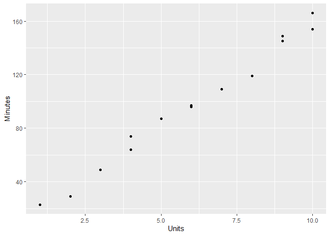
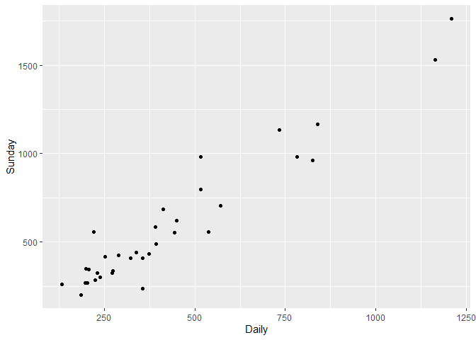

Chapter 02 단순선형회귀
================

## 2.0 library

``` r
library(ggplot2)
```

## 2.3

| Minutes | Units |
|--------:|------:|
|      23 |     1 |
|      29 |     2 |
|      49 |     3 |
|      64 |     4 |
|      74 |     4 |
|      87 |     5 |
|      96 |     6 |
|      97 |     6 |
|     109 |     7 |
|     119 |     8 |
|     149 |     9 |
|     145 |     9 |
|     154 |    10 |
|     166 |    10 |

``` r
df2_5 = read.table("https://www1.aucegypt.edu/faculty/hadi/RABE5/Data5/P031.txt", header = T)
ggplot(data = df2_5, aes(x = Units, y = Minutes)) + 
    geom_point()
```

<!-- -->

``` r
cor(df2_5$Minutes, df2_5$Units)
```

    ## [1] 0.9936987

## 2.5

모형적합은 `lm(Y~X)`을 이용하여 할 수 있다.

``` r
fit2_5 = lm(Minutes ~ Units, data = df2_5)
fit2_5$coefficients
```

    ## (Intercept)       Units 
    ##    4.161654   15.508772


적합값과 잔차는 다음과 같다.

``` r
fit2_5$fitted.values
```

    ##         1         2         3         4         5         6         7         8 
    ##  19.67043  35.17920  50.68797  66.19674  66.19674  81.70551  97.21429  97.21429 
    ##         9        10        11        12        13        14 
    ## 112.72306 128.23183 143.74060 143.74060 159.24937 159.24937

``` r
fit2_5$residuals
```

    ##          1          2          3          4          5          6          7 
    ##  3.3295739 -6.1791980 -1.6879699 -2.1967419  7.8032581  5.2944862 -1.2142857 
    ##          8          9         10         11         12         13         14 
    ## -0.2142857 -3.7230576 -9.2318296  5.2593985  1.2593985 -5.2493734  6.7506266

## 2.6

은
다음과 같다.

``` r
summary(fit2_5)$sigma
```

    ## [1] 5.391725

각 회귀계수가
이라는
가설검정의 결과는 다음과 같다.

``` r
summary(fit2_5)
```

    ## 
    ## Call:
    ## lm(formula = Minutes ~ Units, data = df2_5)
    ## 
    ## Residuals:
    ##     Min      1Q  Median      3Q     Max 
    ## -9.2318 -3.3415 -0.7143  4.7769  7.8033 
    ## 
    ## Coefficients:
    ##             Estimate Std. Error t value Pr(>|t|)    
    ## (Intercept)    4.162      3.355    1.24    0.239    
    ## Units         15.509      0.505   30.71 8.92e-13 ***
    ## ---
    ## Signif. codes:  0 '***' 0.001 '**' 0.01 '*' 0.05 '.' 0.1 ' ' 1
    ## 
    ## Residual standard error: 5.392 on 12 degrees of freedom
    ## Multiple R-squared:  0.9874, Adjusted R-squared:  0.9864 
    ## F-statistic: 943.2 on 1 and 12 DF,  p-value: 8.916e-13

## 2.7

회귀계수에 대한

신뢰구간은 다음과 같다.

``` r
confint(fit2_5, "Units", level = 0.95)
```

    ##          2.5 %   97.5 %
    ## Units 14.40851 16.60903

``` r
confint(fit2_5, "(Intercept)", level = 0.95)
```

    ##                 2.5 %   97.5 %
    ## (Intercept) -3.148482 11.47179

``` r
confint(fit2_5, level = 0.95)
```

    ##                 2.5 %   97.5 %
    ## (Intercept) -3.148482 11.47179
    ## Units       14.408512 16.60903

## 2.8

인
경우의 예측값은 다음과 같다.

``` r
predict(fit2_5, newdata = data.frame(Units = 4))
```

    ##        1 
    ## 66.19674

예측에 대한 신뢰구간은 다음과 같다.

``` r
predict(fit2_5, newdata = data.frame(Units = 4), interval = "prediction")
```

    ##        fit      lwr      upr
    ## 1 66.19674 53.83936 78.55413

평균반응에 대한 신뢰구간은 다음과 같다.

``` r
predict(fit2_5, newdata = data.frame(Units = 4), interval = "confidence")
```

    ##        fit      lwr      upr
    ## 1 66.19674 62.36271 70.03077

## 2.9

결정계수는 다음과 같다.

``` r
summary(fit2_5)$r.squared
```

    ## [1] 0.9874372

## 2.10

원점을 통과하는 회귀모형의 결과를 구할 때는 `lm(Y ~ X - 1)`을 이용한다.

## 2.11

예측변수를 가지지 않는 회귀모형의 결과를 구할 때는 `lm(Y ~ 1)`을
이용한다.

# 연습문제

## 2.10

``` r
df2_10 = read.table("https://www1.aucegypt.edu/faculty/hadi/RABE5/Data5/P052.txt", header = T)
```

### (a)

``` r
cov(df2_10$Husband, df2_10$Wife)
```

    ## [1] 69.41294

### (b)

``` r
cov(df2_10$Husband / 100, df2_10$Wife / 100)
```

    ## [1] 0.006941294

### (c)

``` r
cor(df2_10$Husband, df2_10$Wife)
```

    ## [1] 0.7633864

### (d)

``` r
cor(df2_10$Husband / 100, df2_10$Wife / 100)
```

    ## [1] 0.7633864

### (e)

``` r
cor(df2_10$Husband, df2_10$Husband - 5)
```

    ## [1] 1

### (f)

사회적 통념에 의하면 남자가 여자에게 고백을 하고 결혼하므로 남자를
예측변수, 여자를 반응변수로 선택한다. 물론 이 문제의 정답은 없다고 본다.

### (g), (h)

``` r
fit2_10 = lm(Wife ~ Husband, data = df2_10)
summary(fit2_10)
```

    ## 
    ## Call:
    ## lm(formula = Wife ~ Husband, data = df2_10)
    ## 
    ## Residuals:
    ##      Min       1Q   Median       3Q      Max 
    ## -19.4685  -3.9208   0.8301   3.9538  11.1287 
    ## 
    ## Coefficients:
    ##             Estimate Std. Error t value Pr(>|t|)    
    ## (Intercept) 41.93015   10.66162   3.933 0.000161 ***
    ## Husband      0.69965    0.06106  11.458  < 2e-16 ***
    ## ---
    ## Signif. codes:  0 '***' 0.001 '**' 0.01 '*' 0.05 '.' 0.1 ' ' 1
    ## 
    ## Residual standard error: 5.928 on 94 degrees of freedom
    ## Multiple R-squared:  0.5828, Adjusted R-squared:  0.5783 
    ## F-statistic: 131.3 on 1 and 94 DF,  p-value: < 2.2e-16

가
작으므로 기울기가
이라는
귀무가설을 기각한다.

가
작으므로 절편항이
이라는
귀무가설을 기각한다.

## 2.12

``` r
df2_12 = read.table("https://www1.aucegypt.edu/faculty/hadi/RABE5/Data5/P054.txt", 
                    header = T, sep = "\t")
```

### (a)

``` r
ggplot(data = df2_12, aes(x = Daily, y = Sunday)) + geom_point()
```

<!-- -->

충분히 선형관계라고 생각된다.

### (b)

``` r
fit2_12 = lm(Sunday ~ Daily, data = df2_12)
fit2_12$coefficients
```

    ## (Intercept)       Daily 
    ##   13.835630    1.339715


### (c)

``` r
confint(fit2_12)
```

    ##                  2.5 %    97.5 %
    ## (Intercept) -59.094743 86.766003
    ## Daily         1.195594  1.483836

### (d)

귀무가설: 기울기가
이다.

대립가설: 기울기가
이
아니다.

``` r
summary(fit2_12)
```

    ## 
    ## Call:
    ## lm(formula = Sunday ~ Daily, data = df2_12)
    ## 
    ## Residuals:
    ##     Min      1Q  Median      3Q     Max 
    ## -255.19  -55.57  -20.89   62.73  278.17 
    ## 
    ## Coefficients:
    ##             Estimate Std. Error t value Pr(>|t|)    
    ## (Intercept) 13.83563   35.80401   0.386    0.702    
    ## Daily        1.33971    0.07075  18.935   <2e-16 ***
    ## ---
    ## Signif. codes:  0 '***' 0.001 '**' 0.01 '*' 0.05 '.' 0.1 ' ' 1
    ## 
    ## Residual standard error: 109.4 on 32 degrees of freedom
    ## Multiple R-squared:  0.9181, Adjusted R-squared:  0.9155 
    ## F-statistic: 358.5 on 1 and 32 DF,  p-value: < 2.2e-16

가
작으므로 귀무가설을 기각한다. 즉, 일요일 판매부수와 주중 판매부수 사이에
유의한 관계가 있다.

### (e)

``` r
summary(fit2_12)$r.squared
```

    ## [1] 0.9180597

### (f)

``` r
predict(fit2_12, newdata = data.frame(Daily = 500000), interval = "confidence")
```

    ##        fit      lwr      upr
    ## 1 669871.2 597872.8 741869.7

### (g)

``` r
predict(fit2_12, newdata = data.frame(Daily = 500000), interval = "prediction")
```

    ##        fit      lwr    upr
    ## 1 669871.2 597872.4 741870

(f)에서 구한 결과보다 넓다.

### (h)

``` r
predict(fit2_12, newdata = data.frame(Daily = 2000000), interval = "prediction")
```

    ##       fit     lwr     upr
    ## 1 2679443 2391263 2967623

(g)에서 구한 결과보다 넓다. 이 결과는 주어진 데이터와 멀리 떨어진 값에
대하여 예측을 하므로 부정확한 결과일 것이다.
